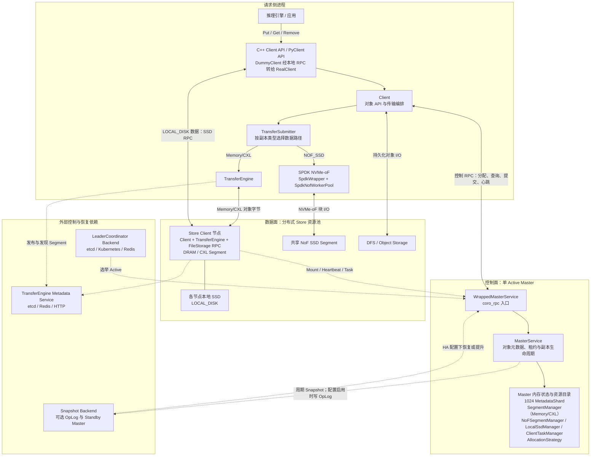
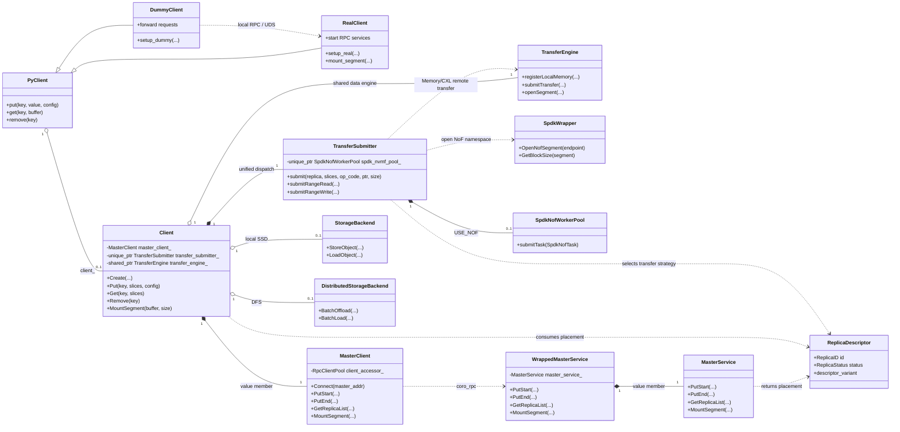
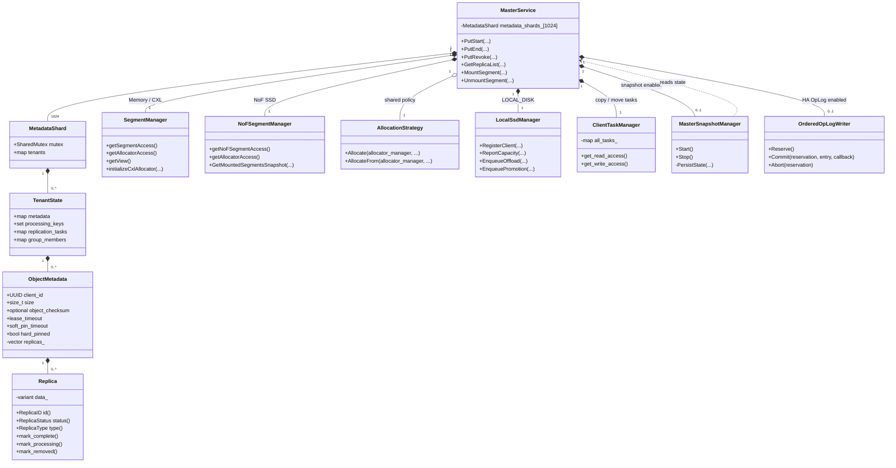
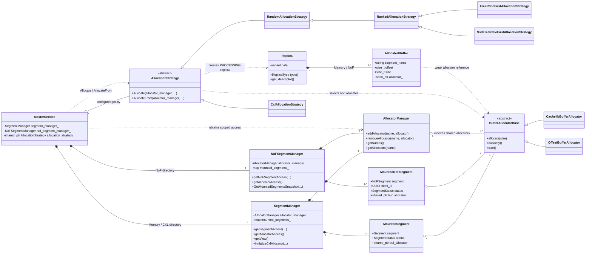
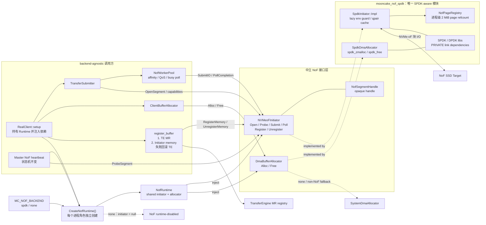
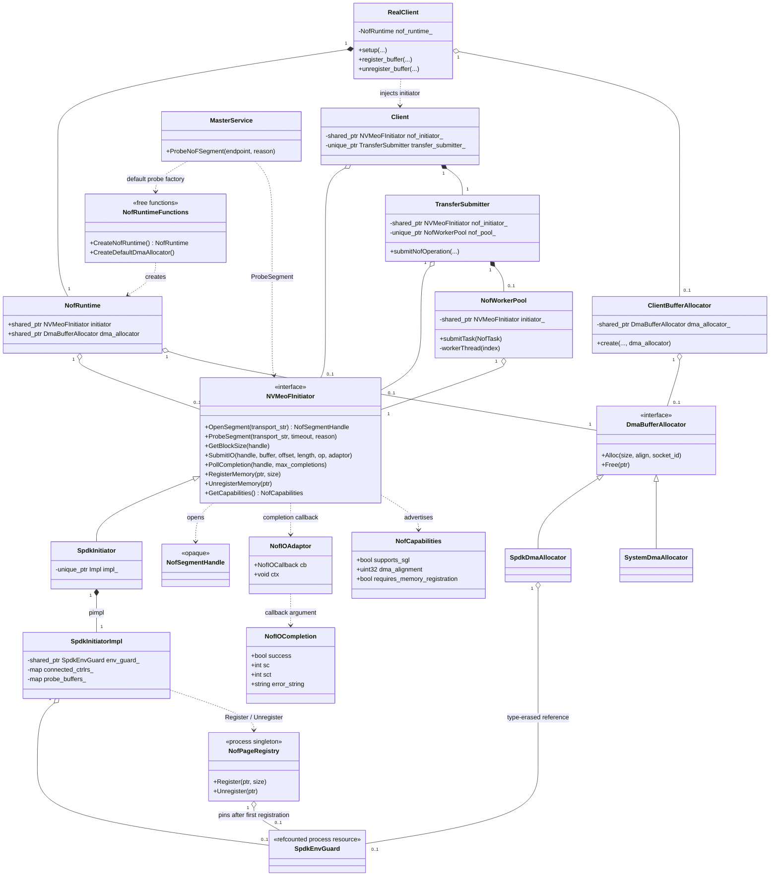

# Mooncake Store 架构与核心类图（AS-IS / TO-BE）

本文整理 Mooncake Store 当前实现的总体架构、关键类、所有权关系和调用依赖，并单独描述 PR #3424 提出的 NoF 数据面解耦目标，便于理解客户端请求如何进入 Master、Master 如何维护对象元数据和分配物理资源，以及不同介质的数据路径。

- AS-IS 以 `design@84ea9937` 为源码基线，只描述当前分支代码。
- TO-BE 以尚未合入的 [PR #3424](https://github.com/kvcache-ai/Mooncake/pull/3424) `de87206` 为基线，描述该 PR head 中已经提出或实现的目标结构，不代表当前分支已有这些类。

## 图例与范围

- `*--`：强所有权；成员按值保存或由 `unique_ptr` 独占。
- `o--`：共享或可选所有权；通常由 `shared_ptr` 保存。
- `..>`：调用或非所有权依赖，包括跨进程 RPC。
- 为保持类图可读，省略配置类、指标类、锁、后台线程、具体 RPC 模板参数和大部分存储后端子类。
- `RealClient`、`DummyClient` 和 `PyClient` 属于 Python/部署入口层；真正执行 Store 对象操作的核心 C++ 类是 `Client`。

## 1. Mooncake Store 当前总体架构

这张图描述的是当前实现边界：

- Mooncake Store 是单 Active Master 架构。普通模式只有一个 Master；HA 模式通过 `LeaderCoordinator` 选举 Active，其他 Master 作为 Standby。
- Master 只维护控制面状态并返回副本描述符。正常对象字节不会流经 `MasterService`。
- 请求侧 `Client` 将副本描述符交给 `TransferSubmitter` 分流：远端 Memory/CXL 通过 `TransferEngine` 搬运，NoF 通过 `SpdkWrapper` 和 `SpdkNofWorkerPool` 执行 SPDK NVMe-oF 块 I/O。NoF 不经过 `TransferEngine`。
- `RealClient` 读取 LOCAL_DISK 副本时，根据描述符中的 endpoint 调用所属 Store Client 的 SSD RPC；DFS 则由分布式存储后端直接读写。
- `SegmentManager` 当前管理 Host Memory/CXL Segment 与其 `AllocatorManager`，NoF 仍由独立的 `NoFSegmentManager` 管理；`MasterService` 使用共享的 `AllocationStrategy` 对两类 allocator 集合执行分配。
- Transfer Engine 使用独立的 Metadata Service 发布和发现 Segment，它不是 `MasterService` 的组成部分。
- Snapshot、OpLog 和 Standby promotion 是不同机制。周期 Snapshot 不等于连续复制；启用 HA/选举也不自动意味着已经启用 OpLog 状态复制。

部署时，同一个 `Client` 既可以发起对象请求，也可以通过挂载 Segment 向资源池贡献内存；`global_segment_size = 0` 时则是纯请求客户端。图中将“请求侧”和“Store 资源池”分开画，是为了强调角色和数据路径，而不是限制二者必须部署在不同进程。

## 2. 客户端入口、控制面与数据面

这张图最重要的边界是：

1. `Client` 通过 `MasterClient` 向 Master 申请或查询副本描述符。
2. `MasterClient` 通过 `coro_rpc` 调用服务端 `WrappedMasterService`；后者是 RPC 包装层，业务状态和逻辑位于其成员 `MasterService` 中。
3. `MasterService` 返回 `Replica::Descriptor`，但不搬运对象数据。
4. `Client` 根据副本类型交由 `TransferSubmitter` 分流：Memory/CXL 选择本地 memcpy 或 `TransferEngine`，NoF 选择 SPDK NVMe-oF，文件类副本则进入对应存储后端。

因此，Master 属于控制面；`Client`、`TransferSubmitter`、`TransferEngine`、SPDK NoF 路径和存储后端共同组成数据面。

## 3. Master 元数据与生命周期管理

这里需要区分三类状态：

- `ObjectMetadata` 是 Master 内存中的对象真相，按 1024 个 `MetadataShard` 分片，并进一步按 Tenant 组织。
- `Replica` 描述每份物理副本及其 `PROCESSING`、`COMPLETE`、`REMOVED` 等生命周期状态；内存和 NoF 副本还持有实际分配得到的 `AllocatedBuffer`。
- `MasterSnapshotManager` 和 `OrderedOpLogWriter` 是可选的恢复/HA 支撑组件，不参与正常对象数据搬运。Snapshot 是周期性状态快照；OpLog 是否启用及其持久性语义取决于 HA 配置。

## 4. 内存、CXL 与 NoF 副本分配

当前代码中有两套资源目录，但共享同一套策略抽象：

- `SegmentManager` 管理 Host Memory/CXL Segment，`NoFSegmentManager` 管理 NoF Segment；两者分别持有自己的 `AllocatorManager` 和 Mounted Segment 映射。
- `MasterService` 先从对应 Manager 取得 allocator 的受锁访问，再调用配置生成的 `AllocationStrategy`。策略从 `AllocatorManager` 中选择 `BufferAllocatorBase`，执行实际分配并创建状态为 `PROCESSING` 的 `Replica`。
- `RandomAllocationStrategy` 和 `CxlAllocationStrategy` 是两条直接策略分支；按剩余空间排序的策略继承自 `RankedAllocationStrategy`。分配策略决定“选哪个 allocator”，allocator 实现负责“怎样切出 buffer”。
- Memory/NoF `Replica` 独占一个 `AllocatedBuffer`；后者只以 `weak_ptr` 回指实际 allocator，释放时由 allocator 回收对应区间。

需要注意，当前 `MasterSnapshotCodec` 没有序列化 `NoFSegmentManager`。因此，NoF 已能参与正常分配，不等于其 allocator 状态已经进入与 Memory 相同的 Snapshot 恢复路径。

## 5. 关键请求如何穿过这些类

### Put

1. `RealClient` 或直接使用 C++ API 的应用调用 `Client::Put`。
2. `Client` 调用 `MasterClient::PutStart`。
3. RPC 到达 `WrappedMasterService::PutStart`，随后进入 `MasterService::PutStart`。
4. `MasterService` 从 `SegmentManager` 或 `NoFSegmentManager` 取得 allocator 集合，并调用 `AllocationStrategy` 分配 Memory/CXL/NoF 副本；其他介质由各自管理器处理。随后将 `Replica::Descriptor` 返回给 `Client`。
5. `Client` 通过 `TransferSubmitter` 执行数据写入：Memory/CXL 走 memcpy 或 `TransferEngine`，NoF 走 SPDK NVMe-oF，文件类副本走相应存储后端；Master 不在数据路径上。
6. 数据写入成功后，`Client` 经同一 RPC 链调用 `PutEnd`，由 `MasterService` 将相应副本从 `PROCESSING` 转为 `COMPLETE`；失败路径调用 `PutRevoke` 释放未提交资源。

### Get

1. `Client::Get` 通过 `MasterClient::GetReplicaList` 查询对象副本和租约。
2. `MasterService` 从 `ObjectMetadata` 中筛选可读的 `COMPLETE` 副本并返回描述符。
3. `Client` 根据描述符从目标 Client/Store 节点、NoF、LOCAL_DISK 或 DFS 读取数据。
4. 远端内存副本通过 `TransferEngine` 传输，NoF 副本通过 SPDK NVMe-oF 读取；两条路径都不经过 `MasterService`。

## 6. 关键类与源码位置

| 类 | 核心职责 | 源码 |
|---|---|---|
| `PyClient` / `RealClient` / `DummyClient` | Python API 抽象及 real/dummy 部署入口 | `mooncake-store/include/{pyclient,real_client,dummy_client}.h` |
| `Client` | 对象 API、数据搬运编排、Segment 注册、本地/远端存储接入 | `mooncake-store/include/client_service.h` |
| `MasterClient` | Master RPC 客户端和租户/Client 身份透传 | `mooncake-store/include/master_client.h` |
| `WrappedMasterService` | RPC 暴露层，将请求转给内部 `MasterService` | `mooncake-store/include/rpc_service.h` |
| `MasterService` | 对象元数据、租约、副本生命周期、资源与任务协调 | `mooncake-store/include/master_service.h` |
| `ObjectMetadata` / `Replica` | 对象到副本的映射及副本状态/介质描述 | `mooncake-store/include/{master_service,replica}.h` |
| `SegmentManager` / `NoFSegmentManager` | 分别维护 Memory/CXL 与 NoF Segment、allocator 目录和挂载状态 | `mooncake-store/include/segment.h` |
| `AllocatorManager` / `AllocationStrategy` | 组织 allocator，并按配置策略选择资源和创建副本 | `mooncake-store/include/allocation_strategy.h` |
| `MountedSegment` / `MountedNoFSegment` | 关联已挂载的 Segment、状态与实际 allocator | `mooncake-store/include/segment.h` |
| `BufferAllocatorBase` / `AllocatedBuffer` | 切分、持有和回收具体介质上的 buffer 区间 | `mooncake-store/include/allocator.h` |
| `TransferSubmitter` | 根据副本类型将数据请求分流到 memcpy、Transfer Engine、SPDK NVMe-oF 或文件读取 | `mooncake-store/include/transfer_task.h` |
| `SpdkWrapper` / `SpdkNofWorkerPool` | 打开 NoF namespace，并执行异步 SPDK NVMe-oF 块 I/O | `mooncake-store/include/{spdk/spdk_wrapper,transfer_task}.h` |
| `TransferEngine` | Client/Store 节点之间的 Memory/CXL 零拷贝数据传输 | `mooncake-transfer-engine/include/transfer_engine.h` |
| `MasterSnapshotManager` | Master 周期快照的调度和持久化编排 | `mooncake-store/include/master_snapshot_manager.h` |

## 7. PR #3424 TO-BE 架构

PR #3424 的目标是把 NoF 数据路径从 SPDK 具体实现中解耦。NoF 仍然通过 NVMe-oF 访问 SSD，并不会改走 `TransferEngine`；变化发生在 `TransferSubmitter`/Master probe 与 SPDK 之间：调用方只依赖中立接口，SPDK 被收敛到独立实现库。

TO-BE 中的关键边界如下：

- `CreateNofRuntime()` 是选择成对 Initiator/Allocator 的工厂。`MC_NOF_BACKEND=spdk` 返回 `SpdkInitiator + SpdkDmaAllocator`；`none` 返回空 initiator，用于运行时禁用 NoF，而不是提供第二种 I/O 后端。
- `RealClient` 持有 `NofRuntime`，把 `NVMeoFInitiator` 注入 `Client`/`TransferSubmitter`，把 `DmaBufferAllocator` 注入 `ClientBufferAllocator`。调用方不再直接访问 `SpdkWrapper` 单例。
- NoF Put/Get 仍由 `NofWorkerPool` 保持原有 worker affinity、QoS 和 busy-poll 模型，但 I/O 改为调用 `NVMeoFInitiator::SubmitIO/PollCompletion`。
- `register_buffer` 先注册 Transfer Engine MR，再向 Initiator 的 DMA translation table 注册；第二步失败时回滚第一步，修复 PR #3131 所描述的半注册问题。
- Master 只借用同一接口执行 `ProbeSegment`。NoF Segment 管理、心跳阈值、卸载和驱逐状态机不属于本 PR 的重构范围。

## 8. PR #3424 TO-BE 核心类图

`SpdkWrapper` 在该目标结构中被删除。`SpdkInitiator::Impl` 隐藏 SPDK 类型、环境生命周期和 controller/namespace/qpair cache；进程级 `NofPageRegistry` 在同一个 SPDK 实现模块中维护 2 MiB page refcount。`NVMeoFInitiator` 只暴露 byte-oriented I/O、opaque handle 和中立 completion 类型。

PR #3424 明确不改变以下内容：

- `ReplicaType::NOF_SSD`、NoF 描述符和 wire protocol；
- Mount/Unmount/Remount RPC 与 Master 的 NoF 资源目录；
- heartbeat、eviction、worker affinity、QoS 和 busy-poll 语义；
- Python ABI 和现有部署参数。

截至本 TO-BE 基线，该 PR 仍处于 Open 状态。PR 作者报告 `USE_NOF=OFF` 构建和相关单元测试通过，但 `USE_NOF=ON` 构建及真实 SPDK/NVMe-oF 运行验证仍待完成。因此，本节是 PR head 的目标视图，不是已合入或已完成硬件验证的能力声明。

### TO-BE 类与 PR 源码位置

| 类/接口 | PR 中的职责 | PR #3424 路径 |
|---|---|---|
| `NVMeoFInitiator` / `NofSegmentHandle` | 中立 NVMe-oF I/O、probe、内存注册与 opaque handle 合约 | `mooncake-store/include/nof/nvmeof_initiator.h` |
| `DmaBufferAllocator` | 与具体 DMA allocator 配对的 `Alloc/Free` 合约 | `mooncake-store/include/nof/dma_buffer_allocator.h` |
| `NofRuntime` / `CreateNofRuntime` | 根据 `MC_NOF_BACKEND` 创建并配对 Initiator/Allocator | `mooncake-store/include/nof/nof_runtime.h` |
| `SpdkInitiator` / `SpdkDmaAllocator` | 中立接口的 SPDK 实现；通过 pimpl 隐藏 SPDK 类型 | `mooncake-store/include/nof/spdk_initiator.h` |
| `NofWorkerPool` / `NofTask` | 保留现有队列、affinity、QoS 和 polling，并调用 Initiator 接口 | `mooncake-store/include/transfer_task.h` |
| `RealClient` / `ClientBufferAllocator` | 持有 Runtime、注入依赖，并协调 TE/Initiator 内存注册 | `mooncake-store/include/{real_client,client_buffer}.h` |
